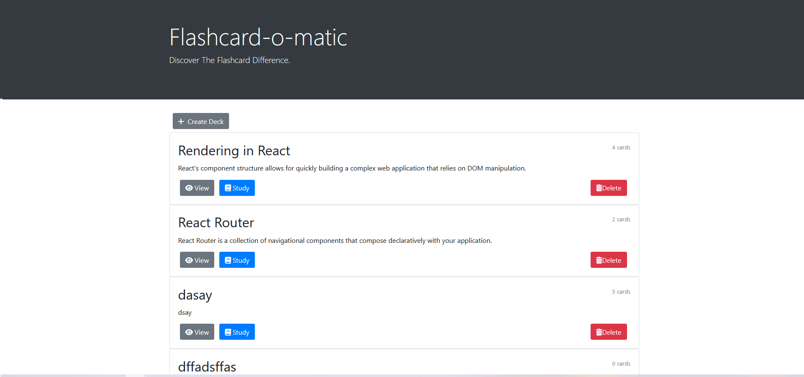
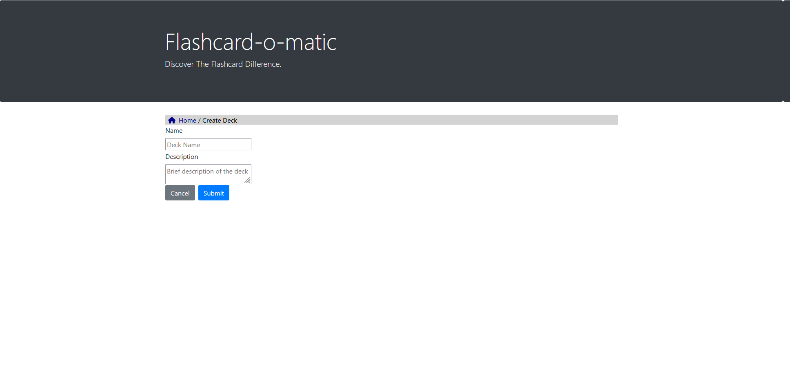
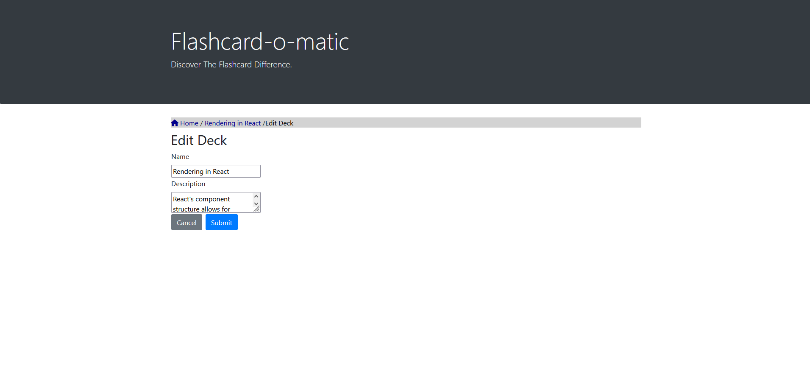
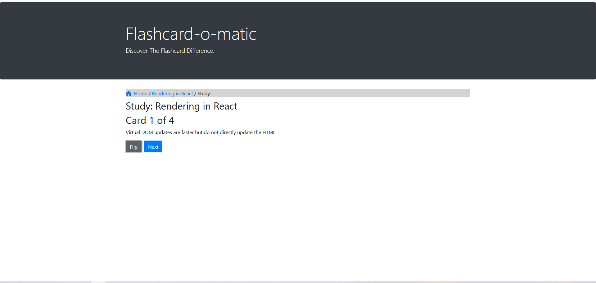
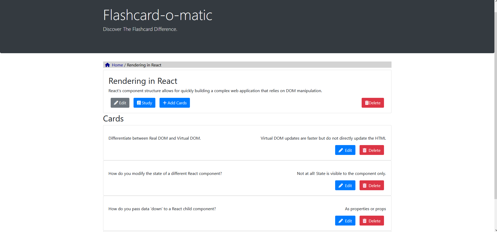
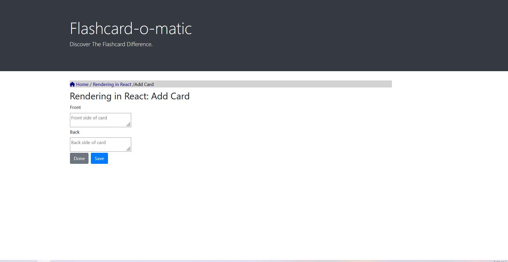
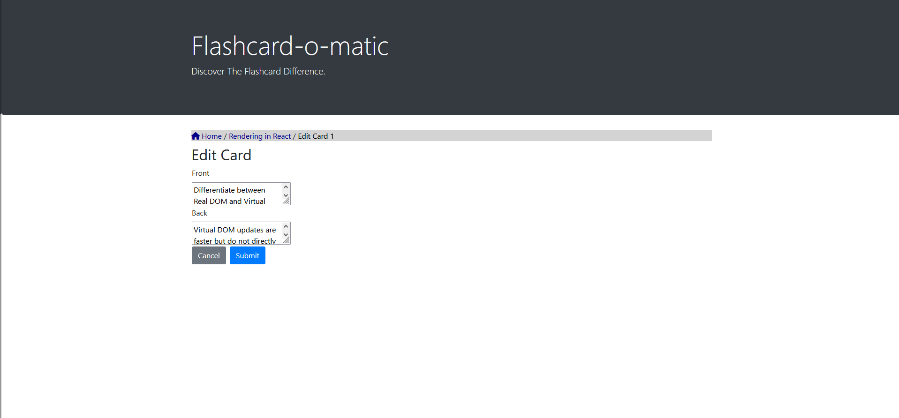

# Flashcard-o-matic

Flashcard-o-matic is a flashcard application developed to help students study online. Teachers can create decks of flashcards for subjects, and students can study the cards in each deck. 
The project focuses on state management and rendering using **React**, alongside controlled components, forms, and routing.

## Table of Contents

- [Project Overview](#project-overview)
- [Technologies Used](#technologies-used)
- [Features](#features)
- [Learning Objectives](#learning-objectives)
- [Project Setup](#project-setup)
- [Usage](#usage)
- [Components Overview](#components-overview)
  - [DeckDelete](#deckdelete)
  - [CreateDeck](#createdeck)
  - [Deck](#deck)
  - [DeckList](#decklist)
  - [AddCard](#addcard)
  - [EditCard](#editcard)
  - [EditDeck](#editdeck)
  - [Study](#study)
  - [CardList](#cardlist)
  - [NotEnoughCards](#notenoughcards)
  - [NavbarCards](#navbarcards)
- [Contributing](#contributing)

## Project Overview

Flashcard-o-matic is designed to facilitate online learning. Teachers can create, edit, and manage decks of flashcards for students to study. The app makes use of **React Router** for navigation and **React Hooks** for state management, ensuring a smooth and interactive user experience.

## Technologies Used
  + **React:** Core JavaScript framework used for building the application.
  + **React Router:** For managing routes and nested routes.
  + **React Hooks:** For state management and handling side effects.
  + **Bootstrap 4:** For layout and basic styling.
  + **JavaScript (ES6):** For logic and state management.

## Features

- Create, edit, and delete flashcard decks.
- Add, edit, and delete individual cards within a deck.
- Study a deck of flashcards and flip through cards.
- Responsive user interface with navigation and breadcrumb trails.
- Confirmation prompts for deleting decks or cards.
- Conditional rendering for managing flashcard study sessions.

## Learning Objectives

This project aims to test the following concepts:

- State management in **React** using `useState()` and `useEffect()`.
- Routing with **React Router**, including nested routes.
- Managing form inputs and controlled components.
- Handling side effects in **React** using `useEffect()`.
- Debugging React applications using the **console** and **VS Code**.
- Building dynamic, interactive components with React.

## Project Setup

To set up this project on your local machine:

1. Clone the repository:
   ```bash
   git clone https://github.com/your-username/flashcard-o-matic.git
   cd flashcard-o-matic
   ```
2. Install dependencies:

    ```bash
    npm install
    ```
3. Start the development server:

    ```bash
    npm start
    ```
4. The app will be available at `http://localhost:3000`.

## Usage
  + **Home Page:** Lists all flashcard decks. From here, you can view, study, edit, or delete decks, or create a new deck.
  + **Create Deck:** Create a new flashcard deck by providing a name and description.
  + **Study Deck:** View flashcards one at a time, flipping them to see both sides. Navigate through the cards sequentially.
  + **Add/Edit Card:** Add or edit flashcards in a deck, providing text for both the front and back of the card.
  + **Edit Deck:** Edit the name and description of a deck.

## Components Overview

### DeckList
  + Lists all available decks, each with options to view, study, or delete the deck.
  + Fetches the list of decks using listDecks() from the API.


### CreateDeck
  + A form that enables users to create new decks.
  + Handles form input for deck name and description using controlled components.
  + Redirects to the newly created deck’s page after submission.


### EditDeck
  + A form that allows users to edit the name and description of an existing deck.
  + Uses controlled inputs and ensures that changes are only saved when submitted.


### Study
  + The main component for studying a deck of flashcards.
  + Displays one card at a time, allowing the user to flip between the front and back.
  + Automatically prompts the user to restart or exit when all cards in the deck have been studied.


### DeckDelete
  + Allows users to delete a specific deck.
  + Confirmation dialog prevents accidental deletions.
  + Upon deletion, redirects to the home page.

### Deck
  + Displays a specific deck, including its name and description.
  + Shows options to edit, study, or delete the deck, and to add new cards.
  + Includes a **CardList** component to display all cards in the deck.

### CardList
  + Displays all the cards in a deck, with options to edit or delete each card.
  + Uses useState() to handle the list of cards and updates dynamically when a card is deleted.


### AddCard
  + A form that allows users to add new flashcards to a deck.
  + Controlled inputs ensure that the form data is managed via useState().
  + Redirects back to the deck’s page after the card is added.


### EditCard
  + A form that allows users to edit existing flashcards.
  + Loads the current card's details using useEffect() and updates the card upon form submission.



### NotEnoughCards
  + If a deck has fewer than 3 cards, this component will display a message and prompt the user to add more cards.

### NavbarCards
  + Displays a breadcrumb navigation for easier navigation between the home page, deck pages, and study pages.


## Contributing
Contributions are welcome! If you have suggestions or improvements, feel free to submit a pull request or open an issue.


